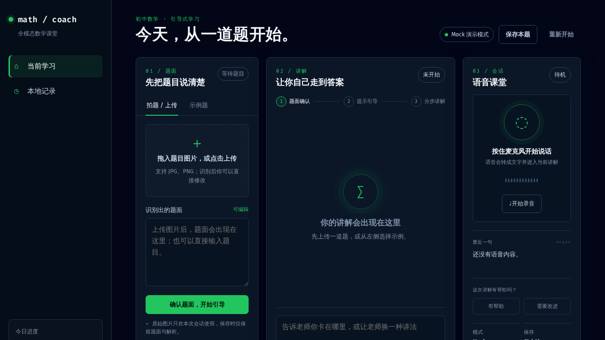
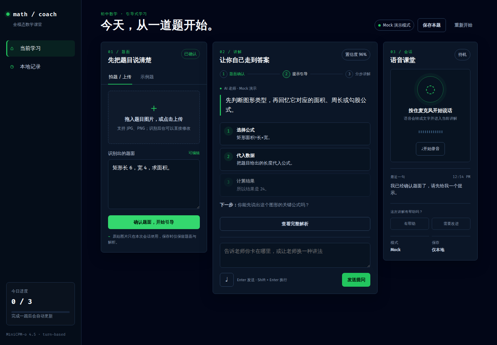
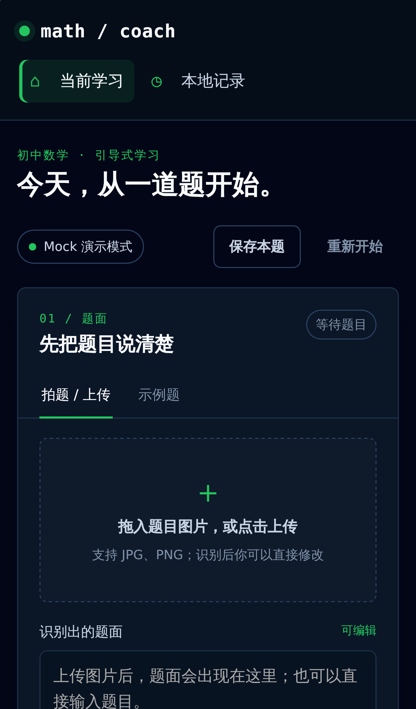

# MiniCPM 全科 Coach · 中小学全科全模态教学 Web Demo

基于 [OpenBMB/MiniCPM-o-Demo](https://github.com/OpenBMB/MiniCPM-o-Demo) 的交互思路，将 MiniCPM-o 4.5 接入可登录的中小学全科课堂：选择学科 → 识题确认 → 苏格拉底提示 → 分步解析 → 文字/语音追问。覆盖语文、数学、英语、物理、化学、政治、历史、地理、生物，推理服务推荐使用 [vLLM-Omni](https://github.com/vllm-project/vllm-omni)。


> 教学应用层负责 **登录鉴权 / RBAC / 课堂编排 / SSE 流式讲解**；模型推理默认由 `config/minicpm.json` 指向远程 **vLLM-Omni OpenAI 兼容接口**，`base_url` 为空时进入明确标注的 **Mock 演示模式**。前端为 React + Vite 深色侧栏工作台，账号存储支持 **SQLite（默认）** 与 **MySQL**。

> **产品定位**：面向中小学生的 MiniCPM-o 多模态全科学习伴侣——九科切换、摄像头拍题、题图贯穿讲解、语音追问、可打断 TTS、错题重练闭环。数学保留确定性 Mock 解析，其余学科使用学科化通用教学 Mock 或真实模型；当前为 Turn-based 应用，不宣称全双工实时语音或视频理解。

### 演示截图



**工作区**：题面输入 / 摄像头拍题 / 文件上传 / 例题 · 引导步骤 · 语音追问



**流式讲解**：`/api/lesson/stream` SSE 增量文本 + 步骤卡片 + 最终答案



**移动端**：顶栏切换当前学习 / 本地记录 / 管理后台

### 演示视频

> 可按下面路径本地自测完整流程；若你有录屏，可替换为 GIF/视频链接。

1. 启动后端 + 前端（或 Docker 一体托管）
2. 在 `.env` 中设置强密码的 `ADMIN_PASSWORD`（及可选演示账号密码）后登录
3. 选择例题、开启摄像头拍题或上传题图/PDF；核对图片标注和可编辑题面后点击「确认题面并开始」
4. 先查看苏格拉底式提示，锁定步骤不展示最终答案；可在底部输入框追问
5. 点击「查看完整解析」查看分步解析与最终答案；按住麦克风追问，播放 TTS 后可点击打断
6. 点击「保存记录」，本地记录仅保存题面、讲解文本和最终答案，不保存原图或录音
7. 标记没听懂进入错题本；学生可从侧栏切到「错题重练」完成同类练习闭环
8. 管理员侧栏进入用户管理

### 项目介绍

本项目把 MiniCPM-o 的多模态能力封装为「可登录的中小学全科课堂 Web」：

- 学生/教师登录后使用识题、提示引导、完整解析与语音追问
- 管理员可查看统计并调整用户角色/状态
- 无 GPU 时用 Mock 保证产品链路可演示；有 GPU 时通过 `config/minicpm.json` 接入真实模型
- 前端与后端可分开发联调，生产由 FastAPI 托管 React 构建产物
- 比赛交付包含真实模型 30 题评测、HTTPS Nginx 模板、公网验证脚本、体验账号重置脚本和 3 分钟演示分镜

### 核心能力一览

#### 登录与权限
- 角色：`admin` / `teacher` / `student`
- 公开注册仅支持学生、教师；管理员由环境变量种子初始化
- 浏览器会话默认使用 **HttpOnly Cookie**（仍兼容 `Authorization: Bearer <token>`）
- 登录/注册响应不返回 token；服务端只保存会话 token 哈希
- 管理员后台：用户统计、角色/状态管理

#### 全科课堂（Turn-based）
- 学科目录由后端 `/api/config` 统一下发：语文、数学、英语、物理、化学、政治、历史、地理、生物；小学一年级至高中三年级年级选项统一纳入账号配置
- `subject` 字段贯穿识题、短期教学会话、普通/流式讲解、反馈和练习推荐；缺省值为 `math`，兼容旧客户端
- 文本粘贴、摄像头实时拍题/文件上传识题、内置例题；整页图片/PDF 逐题识别并展示候选单选列表，模型合并输出时也按题号切分，用户勾选一题后仍可编辑，并转换为 ×、÷、√()、a/b 等可读数学记法
- 题面可编辑确认后才进入讲解；原图保存在服务端 30 分钟教学会话内存中，并随后续讲解继续送给 MiniCPM-o，不写入错题本或本地记录
- 默认苏格拉底提示，提示阶段隐藏锁定步骤结论；学生明确请求后再展示完整、可核验分步解析
- SSE 流式输出；首次提示和普通追问默认仅生成文本，结束后补齐 steps / final_answer；学生点击“朗读”时才单独生成 TTS，并支持取消生成或一键打断
- 浏览器本地保存学习记录（题面、讲解文本和最终答案；不上传原图或录音）
- 听懂 / 没听懂反馈写入账号错题本；学生端按薄弱知识点重练，答案等价判定和递进提示形成学习闭环
- 教学会话、错题本均绑定用户，不能跨用户读取或删除

#### 模型与部署
- Mock 模式：无需 GPU、无需模型权重
- 真实模式：`config/minicpm.json` → vLLM-Omni `POST /v1/chat/completions`
- Docker 多阶段构建（Node 构建前端 + Python 运行后端）
- 数据库：`MATH_COACH_DB_BACKEND=sqlite|mysql`
- 生产默认 `Secure Cookie` + HSTS；支持可信反向代理下的真实 IP 限流
- 提供 `deploy/nginx-https.conf.example` 与 `scripts/verify_https_demo.py`，公网验证会检查 HSTS 和真实 MiniCPM-o 讲解来源

### 技术栈

- 前端：React 19 + Vite 6 + TypeScript + Tailwind 4 本地构建
- 后端：Python FastAPI + Uvicorn
- 鉴权存储：SQLAlchemy + SQLite / MySQL（PyMySQL）
- 推理：vLLM-Omni 托管 MiniCPM-o 4.5（OpenAI compatible）
- 交付：Docker + docker-compose（可选 MySQL profile）

### 快速开始

#### 前置依赖
- Python 3.10+（Web 应用；Docker 使用 3.11）
- Node.js 20+（前端开发 / 构建）
- Docker 部署：Docker Compose v2（使用 `docker compose` 子命令）
- 可选：NVIDIA GPU + Python 3.12 + vLLM-Omni（真实推理）

#### 开发模式
```bash
# 1) 后端
python3 -m venv .venv
source .venv/bin/activate
pip install -r requirements.txt
uvicorn app:app --reload --port 8080

# 2) 前端（另开终端）
cd frontend
npm install
npm run dev
```

打开 http://127.0.0.1:3000  
Vite 已将 `/api` 代理到 `http://127.0.0.1:8080`。

**初始化账号（无内置弱密码）**：

```bash
cp .env.example .env
# 模型默认已指向远程 MiniCPM-o 4.5；如需修改，编辑 config/minicpm.json
# 必填：强密码
export ADMIN_EMAIL=admin@example.com
export ADMIN_PASSWORD="$(python -c 'import secrets; print(secrets.token_urlsafe(18))')"
# 可选本地演示账号
export SEED_DEMO_ACCOUNTS=true
export DEMO_TEACHER_PASSWORD="$ADMIN_PASSWORD"
export DEMO_STUDENT_PASSWORD="$ADMIN_PASSWORD"
```

| 角色 | 环境变量邮箱默认 | 密码 |
| --- | --- | --- |
| 管理员 | `ADMIN_EMAIL` | 必须设置 `ADMIN_PASSWORD` |
| 教师 | `DEMO_TEACHER_EMAIL` | 仅当 `SEED_DEMO_ACCOUNTS=true` 且设置 `DEMO_TEACHER_PASSWORD` |
| 学生 | `DEMO_STUDENT_EMAIL` | 仅当 `SEED_DEMO_ACCOUNTS=true` 且设置 `DEMO_STUDENT_PASSWORD` |

#### 生产构建（FastAPI 一体托管）
```bash
cd frontend
npm install
npm run build          # 输出 frontend/dist
cd ..
source .venv/bin/activate
uvicorn app:app --host 0.0.0.0 --port 8080
```

打开 http://127.0.0.1:8080  
若 `frontend/dist` 不存在，会回退到旧的 `static/` 页面。

#### Docker 部署
```bash
# SQLite + 登录鉴权；默认读取 config/minicpm.json
docker compose up --build -d

# 测试/特殊部署显式覆盖上游地址
VLLM_OMNI_URL=http://gpu-host:8099 docker compose up --build -d

# 使用 MySQL；覆盖文件会等待 MySQL healthcheck 通过
MATH_COACH_DB_BACKEND=mysql docker compose -f docker-compose.yml -f docker-compose.mysql.yml --profile mysql up --build -d
```

容器默认：
- 宿主端口 `${MATH_COACH_PORT:-8089}` 映射容器 `8089`
- SQLite：`/app/data/math-coach.db`（卷 `math_coach_data`）
- 健康检查：`GET /api/health`
- `MATH_COACH_COOKIE_SECURE=true`、`MATH_COACH_ENABLE_HSTS=true`

Docker 直连 HTTP 时浏览器不会保存 `Secure` Cookie；请通过 HTTPS 反向代理访问，或仅本地调试设置 `MATH_COACH_COOKIE_SECURE=false`。

### 环境变量

完整示例见 [`.env.example`](.env.example)。

#### 基础
| 变量 | 默认 | 说明 |
| --- | --- | --- |
| `MATH_COACH_ALLOWED_ORIGINS` | 本地 8080/3000 | CORS 白名单 |
| `MATH_COACH_AUTH_REQUIRED` | `true` | 教学接口是否强制登录 |
| `ADMIN_EMAIL` / `ADMIN_PASSWORD` | 无弱密码默认 | 种子管理员；密码必须强随机 |
| `SEED_DEMO_ACCOUNTS` | `false` | 是否创建演示教师/学生 |
| `MATH_COACH_COOKIE_SECURE` | Compose `true` / 本地自动 | HTTPS 部署必须开启 |
| `MATH_COACH_ENABLE_HSTS` | 随 Secure Cookie | 是否下发 HSTS |
| `MATH_COACH_TRUST_PROXY_HEADERS` | `false` | 仅在可信反向代理正确追加 `X-Forwarded-For` 时开启 |
| `DEMO_*` | 见 `.env.example` | 演示教师/学生账号 |

#### 数据库
| 变量 | 默认 | 说明 |
| --- | --- | --- |
| `MATH_COACH_DB_BACKEND` | `sqlite` | `sqlite` 或 `mysql` |
| `MATH_COACH_SQLITE_PATH` | `data/math-coach.db` | SQLite 文件路径 |
| `MATH_COACH_MYSQL_HOST/PORT/USER/PASSWORD/DATABASE` | - | MySQL 分段配置 |
| `MATH_COACH_MYSQL_DSN` | - | 可选完整 DSN 覆盖 |
| `MATH_COACH_AUTH_DB` | `data/auth-db.json` | 兼容旧路径，用于推导数据目录 |

#### 模型 / 上游
当前 `config/minicpm.json`：

```json
{
  "base_url": "https://minicpm45.duckcloud.fun/v1",
  "model": "/tmp/pretrainmodel/MiniCPM-o-4_5",
  "api_key": "",
  "api_key_env": "MINICPM_API_KEY"
}
```

| 配置 | 默认 | 说明 |
| --- | --- | --- |
| `config/minicpm.json` 的 `base_url` | `https://minicpm45.duckcloud.fun/v1` | OpenAI 兼容模型服务；改成空字符串进入 Mock |
| `config/minicpm.json` 的 `model` | `/tmp/pretrainmodel/MiniCPM-o-4_5` | 服务端 `/v1/models` 返回的模型名 |
| `config/minicpm.json` 的 `api_key` | 空 | 远端启用鉴权时填写；请求发送 Bearer Token |
| `config/minicpm.json` 的 `api_key_env` | `MINICPM_API_KEY` | 优先从已忽略的 `.env` 读取密钥，避免提交明文 |
| `VLLM_OMNI_URL` / `MINICPM_MODEL` | 未设置 | 本地进程显式环境变量覆盖，日常无需设置 |
| `VLLM_OMNI_TLS_VERIFY` | `true` | HTTPS 证书校验 |
| `MINICPM_GATEWAY_URL` | - | 旧别名，兼容保留 |

### 项目结构

```text
ai-teaching-miniCPM/
├── app.py                 # FastAPI 入口（API + 托管 frontend/dist）
├── teaching/              # 鉴权、编排、Mock、MiniCPM 客户端
│   ├── auth_store.py      # SQLite / MySQL 账号与会话
│   ├── model_config.py    # config/minicpm.json 加载与校验
│   ├── security.py        # 安全响应头与限流
│   ├── orchestrator.py    # 教学会话
│   ├── practice.py        # 同类练习推荐
│   ├── minicpm_client.py  # vLLM-Omni OpenAI 适配
│   └── mock_tutor.py      # Mock 演示逻辑
├── frontend/              # React + Vite + TypeScript
│   ├── App.tsx
│   ├── components/        # AuthModal、Icons
│   ├── services/          # api / auth / admin / lesson / notebook
│   └── dist/              # 构建产物（npm run build）
├── static/                # 旧版 HTML 回退页
├── scripts/               # vLLM-Omni 安装/启动、Mock/真实评测、比赛重置与 HTTPS 验证
├── tests/                 # pytest
├── tests/miniCPMclient    # 远程多模态验证客户端
├── docs/                  # 设计与部署文档
├── deploy/                # HTTPS Nginx 配置模板
├── eval/                  # 30 题题集、真实模型评测记录与结果
├── Dockerfile             # Node 构建前端 + Python 运行时
├── docker-compose.yml     # Web + 可选 MySQL profile
└── requirements.txt
```

### API 概览

| 方法 | 路径 | 说明 |
|------|------|------|
| GET | `/api/health` | 健康检查（mode / auth / db_backend） |
| GET | `/api/config` | 公开配置、年级、演示账号标签 |
| POST | `/api/auth/register` `/login` | 注册 / 登录 |
| GET | `/api/auth/me` | 当前用户 |
| POST | `/api/auth/logout` | 退出 |
| PATCH | `/api/me/profile` | 更新昵称/年级 |
| GET | `/api/examples` | 示例题 |
| POST | `/api/recognize` | 识题（文本、图片、多页 PDF、摄像头 JPEG）；返回候选题目列表、默认选题、可编辑题面和短期题图会话 |
| POST | `/api/lesson` | 一轮讲解 |
| POST | `/api/lesson/stream` | **SSE 流式讲解** |
| POST | `/api/feedback` | 反馈 |
| GET | `/api/notebook` | 错题本列表、统计与重练汇总 |
| POST | `/api/notebook/{item_id}/attempts` | 提交错题重练答案，返回递进提示 |
| DELETE | `/api/notebook/{id}` | 删除自己的错题记录 |
| POST | `/api/practice/recommend` | 同类练习推荐 |
| DELETE | `/api/session/{id}` | 删除自己拥有的教学会话 |
| GET | `/api/admin/stats` | 管理统计 |
| GET/PATCH | `/api/admin/users` | 用户列表 / 角色状态 |

浏览器受保护接口自动携带：

```http
Cookie: math_coach_token=<session-token>
```

自动化测试兼容 `Authorization: Bearer <token>`，但登录/注册响应不再返回 token。

### 验证状态（摘录）

- 登录 / RBAC / 管理后台：pytest 覆盖
- 识题 → 提示 → 完整解析 → 会话删除：pytest 覆盖
- SSE 事件契约（`session` / `text_delta` / `lesson`）：pytest 覆盖
- 前端 `npm run build` 通过
- 当前基线：`pytest -q` → **80 passed**；前端 TypeScript/Vite 构建通过
- 远程 MiniCPM 已实测：文本、SSE、图片识题、音频输入、TTS WAV、教学阶段护栏
- 题图贯穿链路已实测：图片识别返回的 `session_id` 与确认后 SSE 讲解一致，真实讲解 `source=minicpm`

#### 真实模型评测基线

完整记录见 [`eval/REAL_MODEL_EVALUATION.md`](eval/REAL_MODEL_EVALUATION.md)，原始报告在 `eval/results/`。

| 指标 | 结果 |
| --- | ---: |
| 请求错误 | 0 / 30 |
| 提示阶段不泄露最终答案 | 30 / 30 |
| 保守答案等价判定 | 24 / 30 |
| 人工复核格式差异后语义正确 | 30 / 30 |
| 完整解析 p50 / p95 | 17.60s / 77.50s |
| 首事件 p50 / p95 | 0.88s / 16.97s |

多模态探测：文本问答成功，图片识题成功，TTS 返回 24 kHz WAV。

## 课堂用法速查

### 1）登录（HttpOnly Cookie）

```bash
# 推荐：保存 HttpOnly Cookie
curl -s -c /tmp/math-coach.cookie -X POST http://127.0.0.1:8080/api/auth/login \
  -H 'Content-Type: application/json' \
  -d "{\"email\":\"$ADMIN_EMAIL\",\"password\":\"$ADMIN_PASSWORD\"}"

# 响应体只包含 cookie_auth 与用户信息；token 只在 Set-Cookie 中
```

### 2）文本讲解（非流式）

```bash
curl -s http://127.0.0.1:8080/api/lesson \
  -b /tmp/math-coach.cookie \
  -H 'Content-Type: application/json' \
  -d '{
    "problem": "解方程：2x + 5 = 17。",
    "message": "给我一个提示",
    "stage": "hint"
  }'
```

### 3）流式讲解（SSE）

```bash
curl -N http://127.0.0.1:8080/api/lesson/stream \
  -b /tmp/math-coach.cookie \
  -H 'Content-Type: application/json' \
  -d '{
    "problem": "解方程：2x + 5 = 17。",
    "message": "请给完整解析",
    "stage": "explain"
  }'
```

### 4）接入真实 MiniCPM-o

```bash
# GPU 主机
./scripts/install_vllm_omni.sh --write-lock
source .venv-vllm-omni/bin/activate
./scripts/start_vllm_omni.sh   # 默认 :8099

# Web 主机
# 修改 config/minicpm.json 后直接启动
uvicorn app:app --host 0.0.0.0 --port 8080
```

安装顺序（见 `requirements-gpu.txt`）：`vllm==0.26.0` → `vllm-omni==0.26.0` → `stepaudio2-minicpmo==0.1.1`。需要 Linux + NVIDIA + Python 3.12。

公网 GPU 服务必须启用 API Key：在 Web 与 GPU 主机生成并配置同一个强随机值，Web 端写入 `.env` 的 `MINICPM_API_KEY`，GPU 端写入 `VLLM_API_KEY` 后重启。重启后匿名请求应返回 401，带 `Authorization: Bearer <key>` 应返回 200。

---

## 文档

| 文档 | 路径 |
|------|------|
| 文档索引 | [docs/README.md](docs/README.md) |
| 需求设计 | [docs/01-需求设计.md](docs/01-需求设计.md) |
| 概要设计 | [docs/02-概要设计.md](docs/02-概要设计.md) |
| 详细设计 | [docs/03-详细设计.md](docs/03-详细设计.md) |
| 数据字典 | [docs/04-数据字典.md](docs/04-数据字典.md) |
| 接口设计 | [docs/05-接口设计.md](docs/05-接口设计.md) |
| 部署与验证 | [docs/06-部署与验证.md](docs/06-部署与验证.md) |
| 比赛演示与评测 | [docs/07-比赛演示与评测.md](docs/07-比赛演示与评测.md) |
| vLLM-Omni 调研 | [docs/vllm-omni-research.md](docs/vllm-omni-research.md) |

过程文档：`task_plan.md` / `progress.md` / `findings.md`

---

## 测试

```bash
# 后端
source .venv/bin/activate
pip install -r requirements.txt
pytest -q

# 前端类型检查 + 构建
cd frontend && npm install && npm run build

# Mock 教学护栏
python3 scripts/evaluate_mock.py

# 真实 MiniCPM-o 30 题评测（先配置 MINICPM_API_KEY）
python3 scripts/evaluate_real_model.py --limit 30 --concurrency 2
```

主要覆盖：
- 健康检查 / Mock 讲解护栏（提示阶段不直接给答案）
- 会话归属与删除
- MiniCPM 适配器 payload / SSE / 音频合并
- 登录注册、RBAC、管理员改角色/禁用账号

建议联调冒烟：
1. 演示管理员登录 → 管理后台可见
2. 学生注册/登录 → 例题提示 → 完整解析
3. 开启摄像头拍题或上传题图/PDF → 确认题面 → 流式讲解
4. 按住说话追问；播放 TTS 后点击打断
5. 标记“没听懂” → 错题本重练 → 同类练习推荐
6. 保持 `config/minicpm.json` 的 `base_url` 非空后顶部模式徽标变为 `MiniCPM-o Real Mode`

## 比赛交付

- 真实模型 30 题评测记录：`eval/REAL_MODEL_EVALUATION.md`
- 评测脚本：`scripts/evaluate_real_model.py`
- 比赛账号/一键重置：`scripts/reset_competition_demo.py`
- HTTPS 部署与验证：`deploy/nginx-https.conf.example`、`scripts/verify_https_demo.py`
- 3 分钟演示分镜：`docs/07-比赛演示与评测.md`

### 比赛体验账号重置

```bash
python3 scripts/reset_competition_demo.py \
  --email student@competition.local \
  --secret-file /tmp/math-coach-competition.env
```

脚本会重置比赛学生账号、登录会话、错题本和重练记录。密码文件必须能设置为仅所有者可读写；WSL/Windows 挂载盘忽略 `chmod` 时脚本会删除密码并失败。

### HTTPS 公网验证

```bash
python3 scripts/verify_https_demo.py \
  --url https://math.example.com \
  --email student@competition.local \
  --secret-file /tmp/math-coach-competition.env
```

验证项包括 HTTPS 首页、HSTS、真实模型配置、比赛账号登录、示例接口、SSE 契约和 `source=minicpm`。

---

## 架构速览

```text
Browser (React SPA)
    │  JSON + HttpOnly Cookie / SSE
    ▼
FastAPI (app.py)
    ├─ AuthStore  ── SQLite / MySQL
    ├─ Orchestrator（教学会话 + 短期题图上下文，内存）
    ├─ Mock Tutor（无上游）
    └─ MiniCPM Client ──► vLLM-Omni /v1（API Key）
                              └─ MiniCPM-o 4.5
```

本地开发：

```text
Vite :3000  ──proxy /api──►  FastAPI :8080
```

生产 / Docker：

```text
Browser ──HTTPS──► FastAPI :8089  (托管 frontend/dist + /api)
```

---

## 技术交流群

欢迎加入技术交流群，分享教学 AI 落地与全模态课堂心得：


## 作者联系

- **作者**: hailaobao
- **微信**: laohaibao2025
- **邮箱**: [Ujfgtujghedte@gmail.com](mailto:Ujfgtujghedte@gmail.com)


## 打赏

如果这个项目对你有帮助，欢迎请我喝杯咖啡 ☕


## 项目统计

### 版本信息

- **当前版本**: v0.3.0
- **主要语言**: Python（后端） / TypeScript（前端）
- **推理引擎**: vLLM-Omni + MiniCPM-o 4.5（可选 Mock）

### 版本历史

- **v0.1.0** — Mock 教学链路、静态前端、识题/讲解/语音骨架
- **v0.2.0** (2026-08) — 登录 RBAC、管理员后台、SQLite/MySQL、React 前端改造、Docker 多阶段构建、文档齐套
- **v0.2.1** (2026-08) — 远程 MiniCPM-o 4.5 实测接入、统一模型配置、错题本、安全加固、API Key 与 HTTPS 部署基线
- **v0.3.0** (2026-08) — 摄像头拍题、题图贯穿后续讲解、真实识题显式降级、TTS 可打断、比赛评测/HTTPS/体验账号交付

---

## 🎉 致谢

感谢以下项目与产品线对本项目提供的支持：

1. [OpenBMB/MiniCPM-o-Demo](https://github.com/OpenBMB/MiniCPM-o-Demo) — 全模态交互产品参考  
2. [vllm-project/vllm-omni](https://github.com/vllm-project/vllm-omni) — MiniCPM-o 在线服务与 OpenAI 兼容接口  
3. [ai-teaching-video-platform](https://github.com/hailaobao2026/ai-teaching-video-platform) — 登录鉴权 / RBAC 形态参考  
4. genai-craft — 前端深色侧栏工作台结构参考  

## 路线图

### 已完成

- [x] 登录 / 注册 / HttpOnly Cookie 会话 / 角色权限
- [x] 管理员用户统计与角色/状态管理
- [x] 文本 / 摄像头拍题 / 文件上传识题 / 例题入口
- [x] 提示式讲解 + 完整解析 + 会话编排
- [x] SSE 流式讲解与前端增量渲染
- [x] React + Vite 前端与后端一体托管
- [x] SQLite / MySQL 双数据库后端
- [x] Docker 多阶段构建与 Compose 交付
- [x] Mock 回归测试与设计文档
- [x] 账号错题本 + 同类练习推荐
- [x] 远程文本 / 图片 / 音频 / TTS 多模态链路实测
- [x] 摄像头拍题、题图贯穿后续讲解、真实模式识题降级显式提示
- [x] 模型地址与模型名配置化，安全审查修复与部署文档同步
- [x] 真实 MiniCPM-o 30 题评测、多模态探测与端到端 App 冒烟
- [x] 比赛账号重置、HTTPS 配置模板、公网验证脚本和 3 分钟演示分镜

### 进行中 / 计划

- [ ] 标注框质量与无坐标降级体验优化
- [ ] Half / Full-duplex 实时课堂能力评估
- [ ] 多实例会话共享（Redis 等）
- [ ] 生产级可观测性（指标、日志、告警）

### 已知边界

1. 标注依赖模型返回归一化坐标；未返回时不凭空画框  
2. 教学会话和题图保存在单进程内存，默认最多 200 个、30 分钟未活动过期；多实例需共享会话或粘性路由
3. 默认 SQLite 适合单机；多实例请切换共享 MySQL
4. 当前为 Turn-based，不承诺全双工实时课堂、端侧推理或视频理解
5. 摄像头和麦克风需要 HTTPS 或 localhost 安全上下文
6. 不保证竞赛/大学高等数学题的正确解析

## License

本项目文档与示例代码默认用于教学演示与二次开发；第三方依赖（vLLM-Omni、MiniCPM 等）请遵循各自开源协议。
