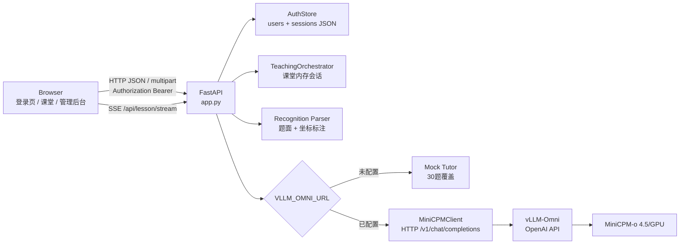
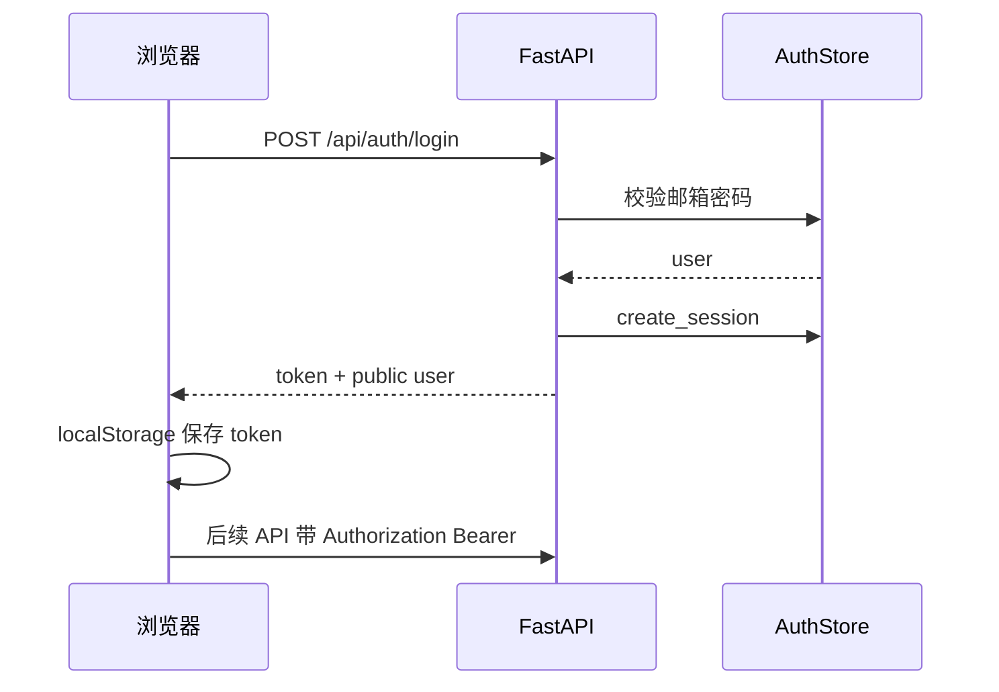
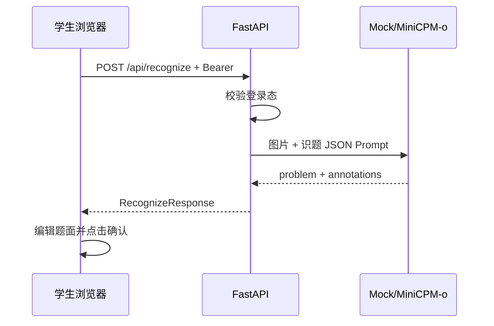
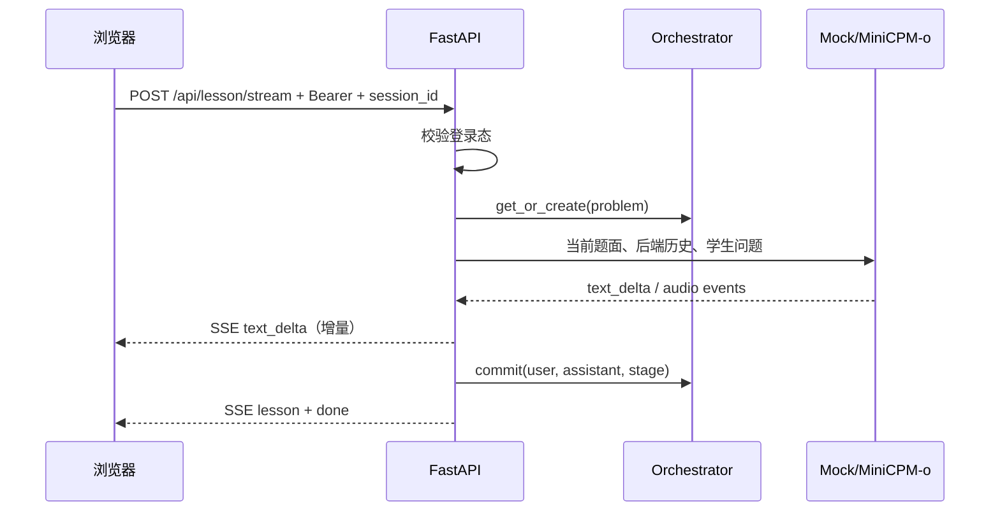

# 概要设计

## 1. 设计原则

1. 教学编排与模型适配分离，Mock 和 MiniCPM-o 使用同一份响应模型。
2. 鉴权与教学会话分离：登录 token 标识用户，`session_id` 仅标识短期课堂状态。
3. 浏览器携带 Bearer Token 与可选 `session_id`；对话历史由后端会话编排器掌握。
4. 结构化步骤从模型文本中解析生成，保持前端展示协议稳定。
5. 外部 GPU 推理由 vLLM-Omni 负责，本项目只实现教学应用层、账号层和适配器。

## 2. 总体架构

前端为 `frontend/` 下的 React + Vite 应用；生产构建后由 FastAPI 托管 `frontend/dist`，开发模式可由 Vite 代理 `/api`。




## 3. 模块划分

| 模块 | 文件 | 职责 |
| --- | --- | --- |
| HTTP 应用 | `app.py` | 路由、鉴权挂载、文件上传、CORS、SSE、错误边界、静态资源 |
| RBAC | `teaching/rbac.py` | 角色归一化、公开注册校验、`public_user` |
| 账号存储 | `teaching/auth_store.py` | 用户/登录会话 JSON 持久化、密码哈希、种子账号 |
| 鉴权依赖 | `teaching/deps.py` | Bearer 解析、`require_user` / `require_admin` |
| 数据模型 | `teaching/models.py` | Pydantic 教学请求/响应、步骤、标注和约束 |
| 会话编排 | `teaching/orchestrator.py` | 创建、复用、提交、过期裁剪和删除课堂会话 |
| 识题解析 | `teaching/recognition.py` | 解析模型 JSON、校验坐标、限制标注数量 |
| Mock 教师 | `teaching/mock_tutor.py` | 示例题和 30 题固定评测集的教学模板 |
| MiniCPM 适配 | `teaching/minicpm_client.py` | 组装 OpenAI 多模态请求、HTTP/SSE 连接、文本/音频事件归一化 |
| Web UI | `static/index.html`、`static/app.js`、`static/styles.css` | 登录注册、课堂工作区、管理后台、录音、标注 Canvas、流式渲染、本地记录 |

## 4. 关键流程

### 4.1 登录流程



### 4.2 识题流程



### 4.3 讲解流程



### 4.4 管理员用户管理

管理员登录后进入管理后台，调用：

- `GET /api/admin/stats`
- `GET /api/admin/users`
- `PATCH /api/admin/users/{id}`

非管理员访问返回 403。

## 5. 部署拓扑

### Mock 本地模式

```text
Browser -> uvicorn app:app:8080 -> AuthStore(SQLite/MySQL)
                                -> Mock Tutor
```

### 真实模型模式

```text
Browser -> math-coach container:8080 -> AuthStore(SQLite/MySQL)
                                      -> http://GPU_HOST:8099/v1/chat/completions
                                      -> vLLM-Omni stages -> MiniCPM-o 4.5/GPU
```

教学应用容器不包含 GPU 推理进程。GPU 主机、模型权重、CUDA 和 vLLM-Omni 服务独立部署和管理。

## 6. 可靠性策略

- 上传前后双重校验 MIME 和大小。
- 密码使用 scrypt 哈希；登录会话默认 7 天过期，可主动 logout 删除。
- vLLM-Omni HTTP 连接超时 `10s`、总响应读取超时 `90s`。
- 模型异常转为用户可读错误响应；Mock 始终可作为离线演示回退。
- 课堂会话超过最大数量时按最近访问时间裁剪，默认最多 200 个。
- SSE 使用增量事件流，前端边收边渲染。
