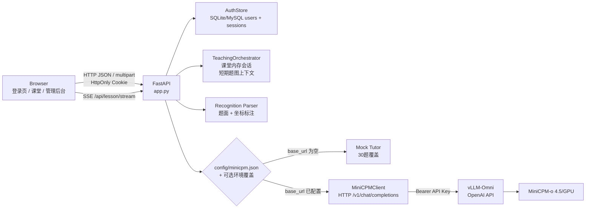
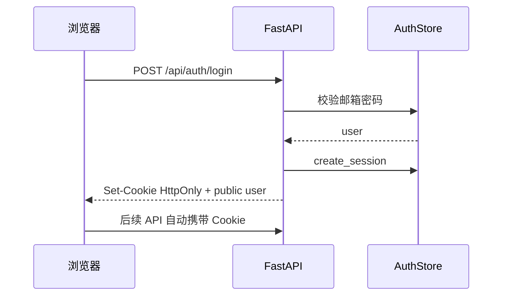
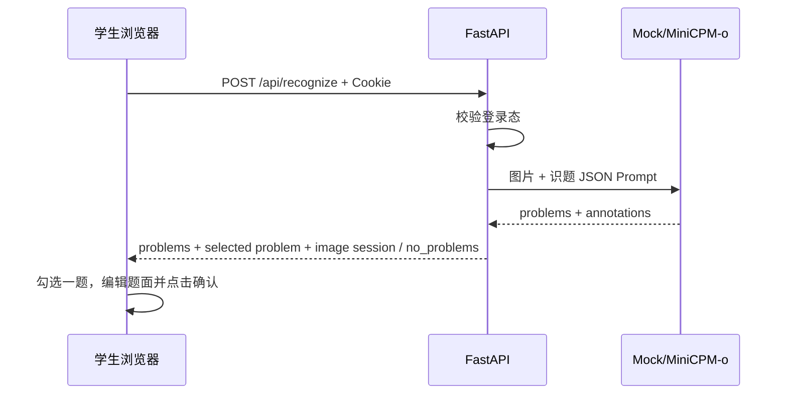
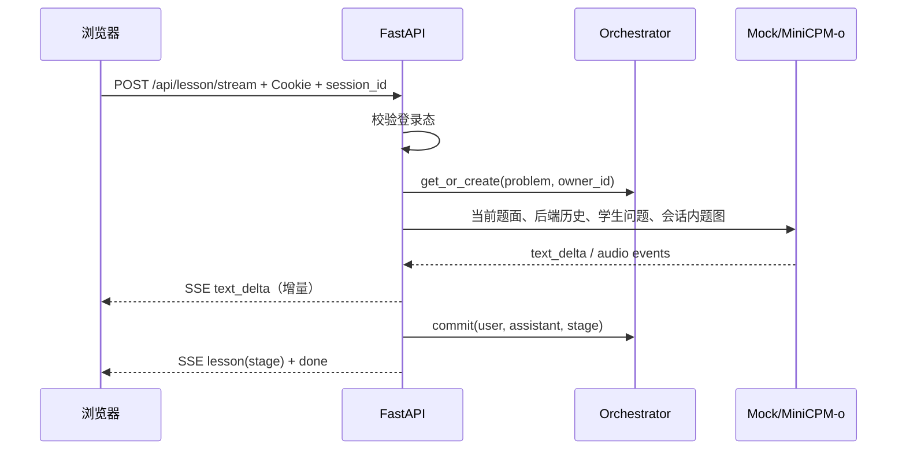

# 概要设计

## 1. 设计原则

1. 教学编排与模型适配分离，Mock 和 MiniCPM-o 使用同一份响应模型。
2. 鉴权与教学会话分离：登录 token 标识用户，`session_id` 仅标识短期课堂状态。
3. 浏览器携带 HttpOnly Cookie 与可选 `session_id`；对话历史由后端会话编排器掌握，课堂会话绑定用户。
4. 结构化步骤从模型文本中解析生成，保持前端展示协议稳定。
5. 外部 GPU 推理由 vLLM-Omni 负责，本项目只实现教学应用层、账号层和适配器。

## 2. 总体架构

前端为 `frontend/` 下的 React + Vite 应用；生产构建后由 FastAPI 托管 `frontend/dist`，开发模式可由 Vite 代理 `/api`。




## 3. 模块划分

| 模块 | 文件 | 职责 |
| --- | --- | --- |
| HTTP 应用 | `app.py` | 路由、鉴权挂载、文件上传、CORS、SSE、错误边界、SPA 安全回退、静态资源 |
| 模型配置 | `teaching/model_config.py` | 读取 `config/minicpm.json`，合并可选环境覆盖，校验 URL/模型名/API Key |
| RBAC | `teaching/rbac.py` | 角色归一化、公开注册校验、`public_user` |
| 账号存储 | `teaching/auth_store.py` | SQLite/MySQL 用户与登录会话、scrypt 密码哈希、SHA-256 会话哈希、种子账号 |
| 鉴权依赖 | `teaching/deps.py` | Cookie/Bearer 解析、`require_user` / `require_admin`、Cookie 属性 |
| 安全中间件 | `teaching/security.py` | CSP/HSTS 等安全响应头、可配置 IP 限流、可信任代理策略 |
| 数据模型 | `teaching/models.py` | Pydantic 教学请求/响应、步骤、标注和约束 |
| 会话编排 | `teaching/orchestrator.py` | 创建、复用、提交、过期裁剪和删除课堂会话 |
| 识题解析 | `teaching/recognition.py` | 解析模型 JSON、校验坐标、限制标注数量 |
| Mock 教师 | `teaching/mock_tutor.py` | 示例题和 30 题固定评测集的教学模板 |
| MiniCPM 适配 | `teaching/minicpm_client.py` | 组装 OpenAI 多模态请求、HTTP/SSE 连接、文本/音频事件归一化 |
| Web UI | `frontend/` | React/Vite 登录注册、课堂工作区、错题本、管理后台、摄像头拍题、录音、TTS 打断、标注 Canvas、流式渲染；`static/` 仅作为回退 |

## 4. 关键流程

### 4.1 登录流程



### 4.2 识题流程



### 4.3 讲解流程



### 4.4 管理员用户管理

管理员登录后进入管理后台，调用：

- `GET /api/admin/stats`
- `GET /api/admin/users`
- `PATCH /api/admin/users/{id}`

非管理员访问返回 403。

## 5. 部署拓扑

### Mock 本地模式

```text
Browser -> uvicorn app:app:8080 -> AuthStore(SQLite/MySQL)
                                -> Mock Tutor
```

### 真实模型模式

```text
Browser --HTTPS--> Nginx -> math-coach container:8089 -> AuthStore(SQLite/MySQL)
                                                        -> https://REMOTE_HOST/v1/chat/completions
                                                        -> vLLM-Omni stages -> MiniCPM-o 4.5/GPU
```

教学应用容器不包含 GPU 推理进程。GPU 主机、模型权重、CUDA 和 vLLM-Omni 服务独立部署和管理。

## 6. 可靠性策略

- 上传前后校验 MIME、文件签名、大小、单边尺寸和总像素。
- 密码使用 scrypt 哈希；登录 token 服务端仅保存 SHA-256 哈希，默认 7 天过期，可主动 logout 删除。
- vLLM-Omni HTTP 连接超时 `10s`、总响应读取超时 `90s`。
- 识题成功但没有完整题目返回 `no_problems=true` 和重拍/手输提示；识题异常没有文本回退时返回明确 502，带文本回退时返回 `degraded=true`、原因和题图会话；讲解阶段模型异常转为用户可读的演示回退。
- `Permissions-Policy` 为 `camera=(self), microphone=(self)`，只允许同源课堂页面使用摄像头和麦克风，同时避免安全头误伤 `getUserMedia`。
- 课堂会话超过最大数量时按最近访问时间裁剪，默认最多 200 个，且默认 30 分钟未活动过期；过期后不复用旧 `session_id`。
- SSE 使用增量事件流，前端边收边渲染。
